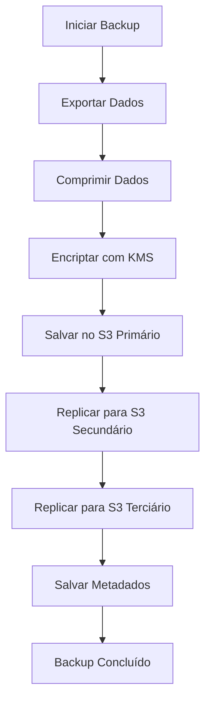

# Sistema de Backup Automático Encriptado e Redundância Multi-Região

## Visão Geral

O sistema de backup automático encriptado e redundância multi-região é uma solução robusta para proteger os dados críticos da aplicação GasRápido. Este sistema garante que os dados estejam sempre disponíveis, seguros e possam ser restaurados rapidamente em caso de falhas ou desastres.

## Arquitetura

### Componentes Principais

1. **Serviço de Backup (`BackupService`)** - Responsável por orquestrar todo o processo de backup
2. **Componente de Gestão (`BackupManagementComponent`)** - Interface de usuário para monitorar e gerenciar backups
3. **Tela de Demonstração (`BackupManagementScreen`)** - Tela React Native para interação com o sistema de backup
4. **Armazenamento AWS S3** - Armazenamento distribuído em múltiplas regiões
5. **Encriptação AWS KMS** - Encriptação de dados em repouso

### Fluxo de Backup



## Configuração

### Variáveis de Ambiente Necessárias

```env
# === BACKUP E REDUNDÂNCIA ===
BACKUP_PROVIDER=aws
AWS_ACCESS_KEY_ID=sua_chave_acesso_aws
AWS_SECRET_ACCESS_KEY=sua_chave_secreta_aws
AWS_REGION=eu-west-1
BACKUP_ENCRYPTION_KEY_ID=alias/gasrapido-backup-key
BACKUP_BUCKET_PRIMARY=gasrapido-backups-eu-west-1
BACKUP_BUCKET_SECONDARY=gasrapido-backups-us-east-1
BACKUP_BUCKET_TERTIARY=gasrapido-backups-ap-southeast-1
BACKUP_SCHEDULE=0 2 * * *  # Diariamente às 2 AM
BACKUP_RETENTION_DAYS=30
```

### Buckets S3

O sistema utiliza três buckets S3 em diferentes regiões para garantir redundância:

1. **Primário**: `gasrapido-backups-eu-west-1` (Irlanda)
2. **Secundário**: `gasrapido-backups-us-east-1` (Norte da Virgínia)
3. **Terciário**: `gasrapido-backups-ap-southeast-1` (Singapura)

## Funcionalidades

### Backup Automático

- Execução automática baseada em cron schedule
- Exportação completa dos dados do Supabase
- Compressão para otimização de armazenamento
- Encriptação AES-256 usando AWS KMS
- Replicação automática para múltiplas regiões
- Política de retenção configurável

### Backup Manual

- Criação de backups sob demanda
- Monitoramento em tempo real do progresso
- Notificações de status

### Restauração

- Restauração seletiva de backups
- Suporte a diferentes ambientes (dev, staging, prod)
- Validação de integridade dos dados

### Limpeza Automática

- Remoção automática de backups antigos
- Baseado na política de retenção configurada
- Liberação de espaço de armazenamento

## Segurança

### Encriptação

- Todos os backups são encriptados em repouso usando AWS KMS
- Chaves de encriptação gerenciadas pela AWS
- Algoritmo AES-256

### Controle de Acesso

- Credenciais AWS com permissões mínimas necessárias
- Políticas IAM restritivas
- Autenticação baseada em roles

## Monitoramento

### Status do Backup

O sistema fornece informações detalhadas sobre o status de cada backup:

- ID único do backup
- Status (pendente, em progresso, concluído, falhou)
- Timestamp de início e conclusão
- Progresso em porcentagem
- Metadados do backup (tamanho, fonte, etc.)

### Logs

- Registro detalhado de todas as operações
- Logs de erros para troubleshooting
- Métricas de performance

## API do Serviço

### Métodos Principais

```typescript
class BackupService {
  // Iniciar backup automático
  async startAutomaticBackup(): Promise<BackupStatus>
  
  // Criar backup manual
  async createManualBackup(source: string): Promise<BackupStatus>
  
  // Restaurar backup
  async restoreBackup(request: RestoreRequest): Promise<boolean>
  
  // Listar backups disponíveis
  async listBackups(limit?: number): Promise<BackupMetadata[]>
  
  // Deletar backups antigos
  async cleanupOldBackups(): Promise<number>
  
  // Obter status do backup
  getBackupStatus(backupId: string): BackupStatus | undefined
}
```

### Tipos

```typescript
interface BackupConfig {
  primaryBucket: string;
  secondaryBucket: string;
  tertiaryBucket: string;
  encryptionKeyId: string;
  region: string;
  backupSchedule: string;
  retentionDays: number;
}

interface BackupMetadata {
  id: string;
  timestamp: string;
  source: string;
  size: number;
  checksum: string;
  encrypted: boolean;
  compression: string;
  region: string;
  bucket: string;
  path: string;
}

interface BackupStatus {
  id: string;
  status: 'pending' | 'in_progress' | 'completed' | 'failed';
  startedAt: string;
  completedAt?: string;
  error?: string;
  progress: number;
  metadata?: BackupMetadata;
}

interface RestoreRequest {
  backupId: string;
  targetEnvironment: 'development' | 'staging' | 'production';
  restorePoint?: string;
}
```

## Interface de Usuário

### Componente de Gestão

O componente `BackupManagementComponent` fornece uma interface completa para:

- Visualização do status do backup atual
- Iniciação de backups manuais
- Restauração de backups
- Listagem de backups disponíveis
- Monitoramento em tempo real do progresso

### Tela de Demonstração

A tela `BackupManagementScreen` demonstra como integrar o componente de gestão em uma aplicação React Native.

## Considerações de Performance

### Otimizações

- Compressão de dados para reduzir tempo de transferência
- Replicação paralela para múltiplas regiões
- Uso de filas para processamento assíncrono
- Cache de metadados para consultas rápidas

### Limitações

- Tamanho máximo de backup depende dos limites do S3
- Tempo de restauração varia com o tamanho dos dados
- Custo associado ao armazenamento em múltiplas regiões

## Manutenção

### Rotinas

- Verificação periódica da integridade dos backups
- Testes de restauração automatizados
- Monitoramento de uso de armazenamento
- Atualização de chaves de encriptação

### Troubleshooting

- Logs detalhados para diagnóstico de problemas
- Métricas de performance para identificação de gargalos
- Alertas para falhas de backup

## Próximos Passos

1. Implementar testes automatizados para o serviço de backup
2. Adicionar suporte para backup incremental
3. Implementar notificações em tempo real para status de backup
4. Adicionar métricas detalhadas para monitoramento
5. Implementar políticas de backup mais granulares por tipo de dado